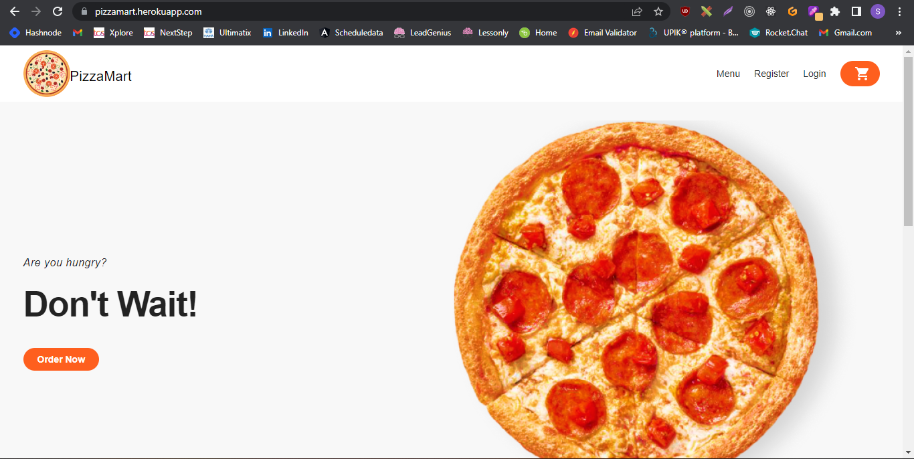
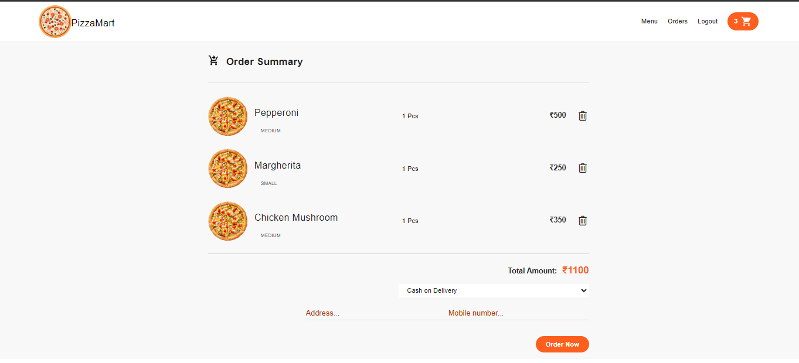
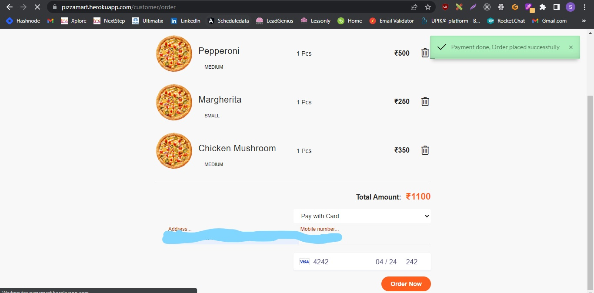
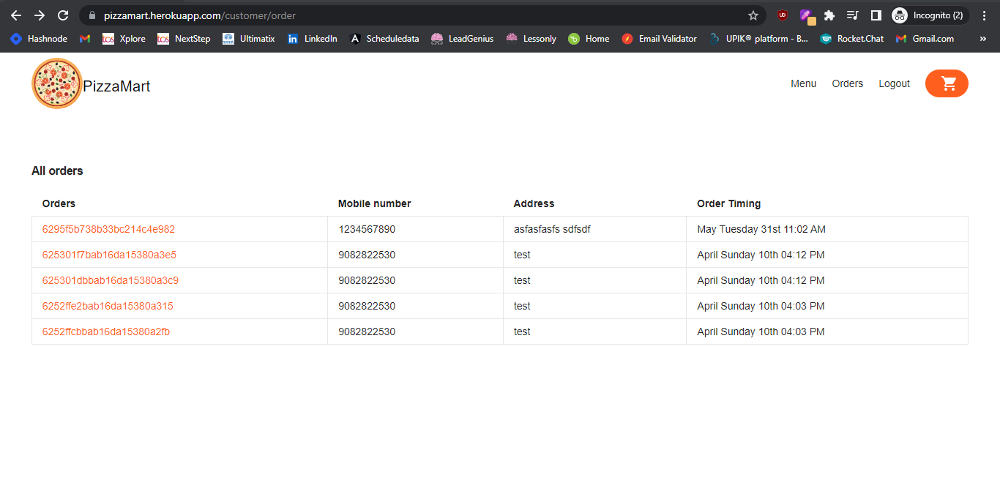
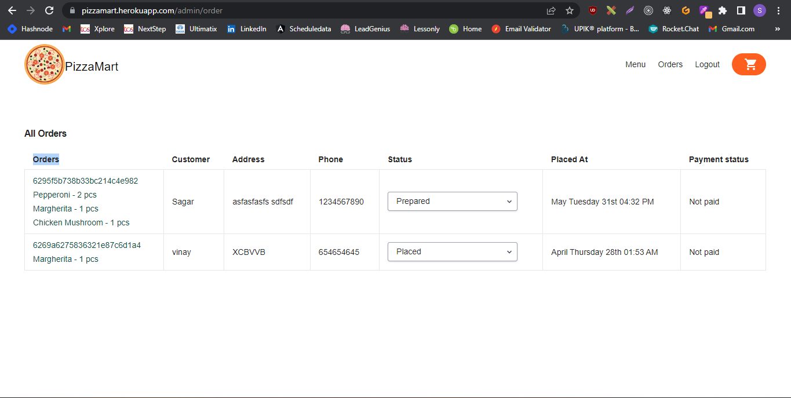
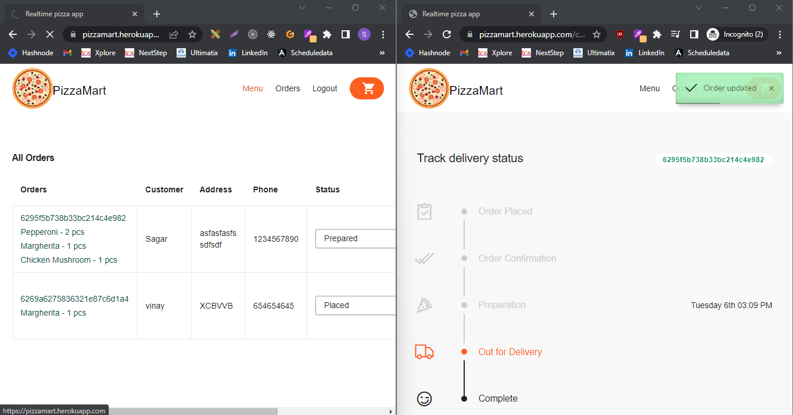

# 🎉Realtime-Pizza-App🪅
------------------------------------------------------------
## Website Link

[Click here](https://pizzamart.herokuapp.com/)
------------------------------------------------------------
## Stack
- **Frontend**
  - ✅EJS, Sass, TailWindCSS
- **Backend**
  - ✅EJS, ExpressJS
- **Database**
  - ✅MongoDB
- **Hosting Platform**
  - ✅Heroku
- **Payment Platform**
  - ✅Stripe

------------------------------------------------------------
## First Page

## Login Page using express-session, bcryptjs, passport

## Checkout Page

## Payment Page

## Order's Page of the Customer

## Delivery status of the Customer

## Admin's Control Page for the orders

## Realtime Updating the Customer Order through Admin control page

## I hope you have like this project🍁
